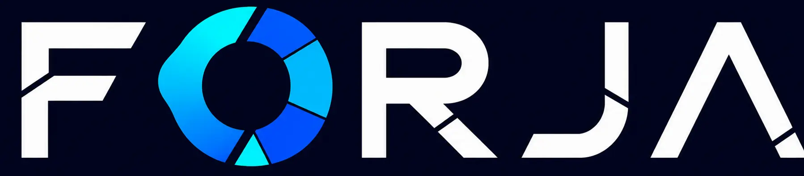

<p align="center">
  
</p>

<p align="center">
  Editor 3D abierto y accesible para convertir medidas e ideas en modelos imprimibles.
</p>

<p align="center">
  <a href="https://forja-3d.frn81.chatgpt.site"><strong>Abrir FORJA</strong></a>
  ·
  <a href="CONTRIBUTING.md">Contribuir</a>
  ·
  <a href="docs/ARCHITECTURE.md">Arquitectura</a>
</p>

<p align="center">
  <a href="https://github.com/franduartedev/forja-3d/actions/workflows/ci.yml"></a>
  
  
</p>

## Qué es FORJA

FORJA es un editor web de diseño 3D pensado para personas que necesitan crear
piezas imprimibles sin aprender primero una herramienta CAD tradicional. Nació
en Argentina con una idea simple: que diseñar una pieza útil sea más accesible
para estudiantes, makers, docentes, técnicos y personas curiosas.

## Funcionalidades actuales

- plantillas paramétricas para cajas, soportes en L y placas;
- editor libre con sólidos, textos y recortes booleanos;
- selección directa en la vista 3D y transformación por ejes;
- multiselección, alineación, distribución, duplicado y deshacer/rehacer;
- recortes y agujeros posicionables mediante un plano visual;
- estimaciones básicas de material, tiempo y costo;
- guardado local del proyecto;
- exportación en STL, 3MF y STEP.

## Desarrollo local

Requiere Node.js `>=22.13.0`.

```bash
npm ci
npm run dev
```

La aplicación queda disponible en la dirección que informa Vite. Los diseños
se procesan en el navegador y los proyectos se guardan localmente en el equipo.

En VS Code se incluyen tareas listas para abrir el servidor y ejecutar todas
las verificaciones. Abrí **Terminal → Ejecutar tarea** y elegí una opción que
empiece con `FORJA:`. También se recomienda la extensión oficial de Codex para
trabajar junto al código.

## Verificación

```bash
npm run lint
npm run typecheck
npm test
```

`npm test` ejecuta las pruebas unitarias de parámetros, operaciones del editor,
geometrías, booleanos y exportadores; después construye y valida el Worker que
se despliega en Sites.

## Estructura

- `app/`: interfaz y estilos;
- `lib/model-geometry.ts`: generación de geometrías y operaciones CSG;
- `lib/model-exporters.ts`: exportadores 3MF y STEP;
- `lib/slicing-contract.ts`: perfiles y validaciones compartidas del laminador;
- `lib/editor-operations.ts`: operaciones puras del editor;
- `services/slicer/`: contrato y documentación del futuro servicio de G-code;
- `docs/`: arquitectura y decisiones técnicas;
- `tests/`: pruebas unitarias y verificación del artefacto;
- `worker/`: punto de entrada de Cloudflare/Vinext.

## Preparación de impresión

El frontend no genera G-code todavía. La arquitectura separa el editor web del
servicio que ejecutará PrusaSlicer para evitar crear archivos con un perfil
incorrecto. La primera impresora objetivo es la BIQU B1 de 0,4 mm; el perfil se
validará con impresiones pequeñas antes de habilitarlo para usuarios.

Consultá [la arquitectura](docs/ARCHITECTURE.md) para ver el plan de laminado y
la futura integración con OctoPrint.

## Estado de la V1

La V1 permite diseñar y exportar modelos. Todavía no genera G-code ni inicia
impresiones: el archivo exportado debe abrirse en Cura, OrcaSlicer,
PrusaSlicer u otro laminador configurado para la impresora del usuario.

Los errores y propuestas pueden publicarse mediante los formularios de
[Issues](https://github.com/franduartedev/forja-3d/issues).

## Licencia

Copyright © 2026 Francisco Duarte / FD Labs.

FORJA 3D se distribuye bajo la
[GNU Affero General Public License v3.0](LICENSE) (`AGPL-3.0-only`). Podés usar,
estudiar, modificar y redistribuir el proyecto bajo sus términos. Si publicás
una versión modificada como servicio web, también debés ofrecer a sus usuarios
el código fuente correspondiente de esa versión.

El nombre y el logotipo de FORJA no conceden derechos de marca adicionales por
el solo hecho de distribuirse junto al código.

## Autor

Ideado y dirigido por [Francisco Duarte](https://github.com/franduartedev)
bajo la identidad de FD Labs. Desarrollado mediante un proceso iterativo de
diseño de producto, pruebas funcionales y programación asistida por IA.
